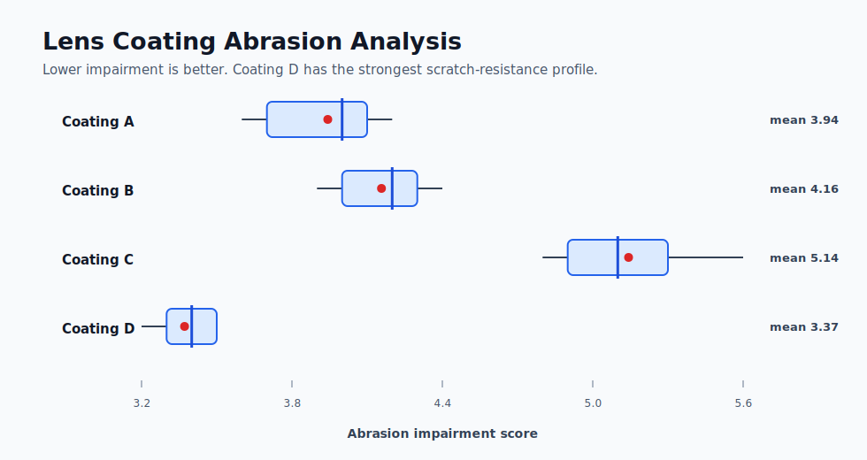

# Lens Coating ANOVA

Classical statistical analysis in R, focused on experimental comparison and evidence-based recommendation.

## Case Study: Lens Coating Abrasion

A glass manufacturer compares four protective lens coatings after simulated abrasion. Lower impairment values indicate stronger scratch resistance.

## Method

- Descriptive statistics by coating.
- Boxplot comparison.
- Shapiro-Wilk normality checks.
- Levene's test for equal variance.
- One-way ANOVA.
- Tukey HSD post-hoc comparisons.

## Finding



The analysis recommends **Coating D**. It has the lowest mean impairment score, the lowest variability, and statistically significant improvements over the other coatings under Tukey HSD comparisons.

## Repository Structure

```text
.
├── R/
│   └── lens_coating_anova.R
├── data/
│   └── lenses.csv
├── requirements.md
└── README.md
```

## Run

Open R or RStudio from the repository root and run:

```r
source("R/lens_coating_anova.R")
```

## Interpretation

The analysis uses hypothesis testing to move from visual impression to defensible recommendation: first checking assumptions, then testing whether group means differ, then identifying which coatings differ materially.
